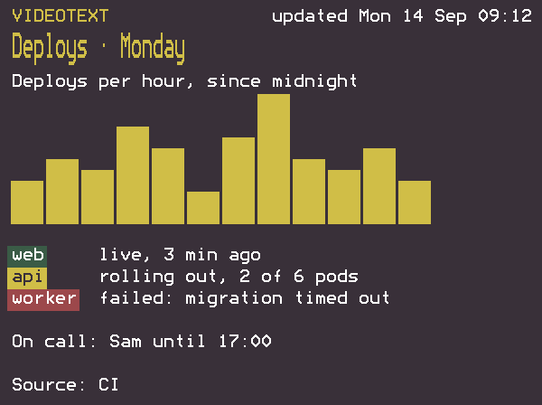
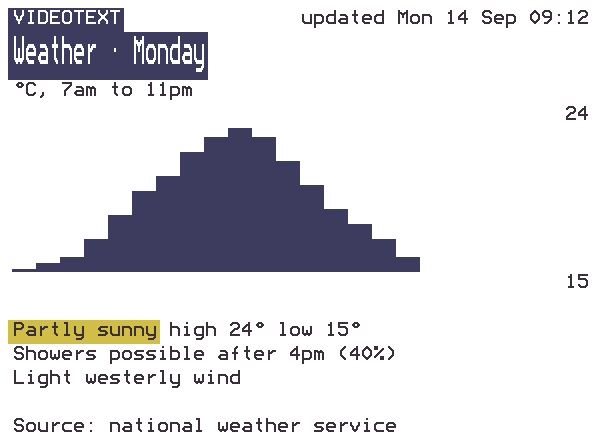

# Inkplate Videotext

An e-paper wall display that agents can write to. Videotext is firmware for the Soldered Inkplate 6COLOR. The board joins your WiFi and runs its own MCP server and HTTP API, so Claude Code, any other MCP client or a shell script on your network can put a screen on the wall. The look is borrowed from 1980s teletext: a fixed grid of big letters in seven colours.

There is nothing to run on a computer. The board keeps the screen in flash, renders it with the Bedstead teletext font and refreshes the panel only when the screen changes.

<p>
  
  
</p>

Both images come from the firmware's own renderer. The panel shows the same pixels in slightly muted colours.

> [!WARNING]
> **Use at your own risk.** This firmware is provided "as is", without warranty of any kind, express or implied, including the warranties of merchantability, fitness for a particular purpose and non-infringement.
>
> - **Flashing it replaces whatever your Inkplate runs now.** `make backup` reads the whole 4 MB flash off the board and `make restore-backup` writes it back, but nothing guarantees either will work on your unit.
> - **Keep the board off the internet.** It answers plain HTTP with one shared key, and pressing its button shows that key on the wall. Anyone on the same network who can read the wall can change it.
> - **You are responsible for what you do with it.** In no event shall the authors or contributors be liable for any claim, damages or other liability, including a board that won't boot, lost data or a compromised network, arising from the use of this software or the instructions in this README.
> - **Feel free to modify it.** Fork it, change it and share it under the [MIT License](LICENSE), which carries the full disclaimer of warranty and limitation of liability.
>
> Videotext is an independent project, not affiliated with or endorsed by Soldered Electronics, the maker of the Inkplate.

## What You Need

- A [Soldered Inkplate 6COLOR](https://docs.soldered.com/inkplate/6color/overview/), the 600x448 version with the seven-colour e-paper panel attached. Other Inkplate models have different chips and panels, and this firmware doesn't support them.
- A USB cable that carries data, and USB power where the wall will hang. WiFi stays on all the time, so a battery won't last long.
- A 2.4 GHz WiFi network with a WPA2 or WPA3 password. The ESP32 has no 5 GHz radio, and enterprise logins (a username as well as a password) aren't supported.
- A Mac or Linux computer with `make` to build and flash the firmware. It has been built and tested on macOS.

## Set Up the Board

### 1. Install the Toolchain

Install [arduino-cli](https://arduino.github.io/arduino-cli/latest/installation/) (`brew install arduino-cli` on a Mac), then the Inkplate board support and the two libraries. These are the versions the firmware is tested with:

```sh
arduino-cli core install soldered-inkplate-boards:esp32@4.0.0 \
  --additional-urls https://raw.githubusercontent.com/SolderedElectronics/Inkplate-Board-Definitions-for-Arduino-IDE/refs/heads/main/package_Inkplate_Boards_index.json
arduino-cli lib install InkplateLibrary@11.1.5 ArduinoJson@7.4.3
```

### 2. Configure the Board

```sh
git clone https://github.com/kohlhofer/inkplate.git videotext
cd videotext
cp sketches/videotext/config.example.h sketches/videotext/config.h
```

Open `sketches/videotext/config.h` and set five values. The file is gitignored, so your WiFi password stays out of commits.

| Setting | What to put there |
|---|---|
| `WIFI_SSID` | Your WiFi network's name. It must offer 2.4 GHz. |
| `WIFI_PASS` | Its password. |
| `API_KEY` | The key every request must send. A plain word is fine. It keeps guests' devices and stray scripts off the wall, and the wall shows it to anyone standing in front of it, so it is not a secret. |
| `HOSTNAME` | The board's name on the network, `videotext` by default, which makes it `http://videotext.local`. Give each board its own name if you have more than one. |
| `TIMEZONE` | A POSIX time zone string for the "updated" time in the header. New York is `EST5EDT,M3.2.0,M11.1.0`, Los Angeles `PST8PDT,M3.2.0,M11.1.0`, London `GMT0BST,M3.5.0/1,M10.5.0`, Berlin `CET-1CEST,M3.5.0,M10.5.0/3` and Sydney `AEST-10AEDT,M10.1.0,M4.1.0/3`. [This table](https://github.com/nayarsystems/posix_tz_db/blob/master/zones.csv) has every other zone. |

That's everything you need to change. The header label and the time servers are in `sketches/videotext/videotext.ino` if you want to go further.

### 3. Flash It

Switch the board on with the switch on its side, connect it over USB and run:

```sh
make upload
```

The first build takes a few minutes. `make upload` finds the board's serial port on its own, and it stops with a message if `config.h` is missing or no board is connected.

For a way back to the factory firmware, run `make backup` before the first upload. It copies the board's whole flash into `firmware-backup/` in about six minutes, and `make restore-backup BACKUP=firmware-backup/<file>.bin` writes it back.

### 4. First Start

About a minute after you switch it on, the wall shows its connection details: its IP address, the API key and the command that connects Claude Code. The panel flashes for about 30 seconds every time it redraws, which is normal for this kind of e-paper.

If the wall says "Joining WiFi…" and stays there, see [Troubleshooting](#troubleshooting).

## Connect an Agent

Press the button on the side of the board to bring up the connection details at any time, and press it again to go back to the screen. For Claude Code:

```sh
claude mcp add --scope user --transport http videotext http://<board-ip>/mcp --header "X-Api-Key: <key>"
```

Claude Code needs the IP address, because it can't resolve `.local` names. Browsers, curl, Node and other MCP clients can use `http://videotext.local` too. Reserve the board's address in your router's DHCP settings so the IP doesn't change under your agents.

The MCP server explains itself. Its instructions and the `show_screen` description carry the complete layout and markup rules, and every call returns a PNG of exactly what the wall will draw, so an agent can check its own work. An agent needs nothing beyond the connection.

| Tool | What it does |
|---|---|
| `show_screen` | Replaces the screen and returns the preview image and any warnings |
| `preview_screen` | Renders a screen without touching the wall |
| `get_screen` | Returns the current screen's fields, its state and an image of it |
| `clear_screen` | Removes the screen, so the wall shows its connection details |

The repo also has a Claude Code skill in `.claude/skills/videotext` that tells Claude when to use the wall and to leave other people's screens alone. It loads when Claude Code runs inside this repo. Copy the folder to `~/.claude/skills/` to have it in every project.

## Send a Screen Over HTTP

Every request except `GET /` needs the key, as `X-Api-Key: <key>` or `Authorization: Bearer <key>`. JSON bodies need `Content-Type: application/json`.

```sh
curl -X PUT http://videotext.local/screen \
  -H "X-Api-Key: $KEY" -H "Content-Type: application/json" \
  -d '{"title": "Build status", "body": "{green}main{/} passed\n{red}release{/} failed: 2 tests", "footer": "CI"}'
```

| Endpoint | Purpose |
|---|---|
| `GET /` | The full guide, no key needed |
| `GET /screen` | The current screen as JSON, with its state and update time |
| `PUT /screen` | Replace the screen; only `title` is required |
| `POST /preview` | Render a screen to PNG without showing it; warnings in `X-Warnings` |
| `GET /preview` | PNG of what the wall should show now |
| `DELETE /screen` | Remove the screen |
| `GET /status` | IP, battery, signal, uptime, refresh state |
| `POST /mcp` | The MCP endpoint |

## What a Screen Looks Like

The wall is a fixed grid of 50 by 18 character cells, so senders choose words, not positions. The board draws the top row: "VIDEOTEXT" and when the screen was sent. The title is double height and holds 48 characters. The body is 48 characters wide and 14 rows tall, and an optional one-line footer sits at the bottom.

In the body, colour tags carry meaning: `{red}` needs a person, `{yellow}` is attention, `{green}` is fine and `{blue}` is information. Lines between two ```` ``` ```` fences are cropped instead of wrapped and keep their spacing, which is how tables and box-drawing or block-character pictures line up. A `chart` takes numbers, either a `spark` trend or `bars` from zero. `theme` is `dark` or `light`. There are no images.

`GET /` on the board has the complete rules. It's the same text agents receive over MCP.

## How the Wall Behaves

A new screen triggers a full refresh that flashes the panel for about 30 seconds. If several screens arrive during a refresh, the board draws only the newest once it finishes, and the API reply says how long until the new screen is readable. A screen survives power loss and reboots, and the board never redraws a frame that is already on the panel.

When WiFi drops, the board tries to rejoin after 20 seconds and restarts itself if it's still offline after five minutes.

## Reach the Wall From Anywhere With Tailscale

This part is optional and macOS only. It's the way to reach the wall from outside your home without putting it on the internet. The ESP32 can't run Tailscale, so a Mac that stays on at home puts the wall in your tailnet as its own node, `videotext`. The node serves `https://videotext.<tailnet>.ts.net` with a real certificate and forwards to the board on the LAN. It's a second `tailscaled` in userspace mode with its own state, so it runs next to the Tailscale app without touching it.

Only devices in the same tailnet, or ones you share the node with, can reach that address. Don't turn on Funnel. Your tailnet needs MagicDNS and HTTPS certificates turned on.

1. `brew install tailscale && brew unlink tailscale`. Unlinking keeps the Tailscale app's own CLI first on your PATH; the script calls Homebrew's copy directly.
2. `tailnet/videotext-proxy.sh start`, open the login link it prints and approve the node. Then `tailnet/videotext-proxy.sh stop`. The node's state survives, so you only approve it once.
3. `make tailnet-install` runs the proxy as a login service, and `make tailnet-uninstall` removes it. It finds the board as `videotext.local` (pass `VT_BOARD=http://<name>.local` if you changed `HOSTNAME`) and checks every minute whether that name points somewhere new, so a DHCP change doesn't break it.
4. Point agents at the tailnet name, which Claude Code resolves fine:

   ```sh
   claude mcp add --scope user --transport http videotext https://videotext.<tailnet>.ts.net/mcp --header "X-Api-Key: <key>"
   ```

`VT_EPHEMERAL=1 tailnet/videotext-proxy.sh start` makes a throwaway node that leaves the tailnet once it stops, which is handy for trying this out.

## Troubleshooting

- `make upload` finds no serial port, or esptool reports "No serial data received": the switch on the side of the board is off. The USB chip shows up even with the board switched off, but the ESP32 doesn't answer. On Linux, also check that your user is in the `dialout` group.
- The wall stays on "Joining WiFi…": check `WIFI_SSID` and `WIFI_PASS` and that the network offers 2.4 GHz, then flash again. `make log` prints the board's serial output, including why WiFi failed.
- Claude Code times out connecting to `http://videotext.local/mcp`: register the IP address instead, as above.
- A `curl -d` request fails with a 400 about the body: add `-H "Content-Type: application/json"`. Without it curl sends a form, and the board ignores the body.
- `GET /status` with the key shows the board's signal strength, uptime, how often WiFi has dropped and the last disconnect reason.

## Development

`make test-native` builds the renderer and protocol code for your computer and tests them. It needs `clang++`, Node 23 or newer, and `npm install` run once. The renderer has to match the archived Node renderer pixel for pixel across 29 fixtures, and the MCP handler, request validation and PNG encoder have their own tests. `make log LOG_SECONDS=90` captures the board's serial output, one line per redraw. `make font` regenerates the font header from `font/bedstead.c`. [CLAUDE.md](CLAUDE.md) has the hardware and firmware gotchas and the checks to run on the board after flashing.

The first version, a Node relay on a computer serving many pages to a board that polled it, is kept in [archive/relay](archive/relay/README.md).

## Credits and Licence

- **Font** [Bedstead](https://bjh21.me.uk/bedstead/) by Ben Harris and Simon Tatham, built on the Mullard SAA5050 teletext character set and dedicated to the public domain under CC0 1.0. `font/bedstead.c` is included with its notice in [`font/LICENSE-BEDSTEAD`](font/LICENSE-BEDSTEAD).
- **[InkplateLibrary](https://github.com/SolderedElectronics/Inkplate-Arduino-library)** by Soldered drives the panel. It is LGPL-3.0 and installed through the Arduino library manager, not included here.
- **[ArduinoJson](https://arduinojson.org)** by Benoit Blanchon parses and writes every request. It is MIT and installed the same way.

Copyright © 2026 Alexander Kohlhofer. Licensed under the [MIT License](LICENSE).
